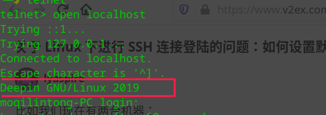

# Shell 学习笔记--范例剖析2

---------

## 范例展示

> 此范例来自 [Ubuntu 系统使用脚本配置阿里云公共 DNS](https://alidns.com/knowledge?type=SETTING_DOCS#user_linux) ，虽然作者使用的 Linux 发行版是 Deepin 20.1，而非 Ubuntu ，但此脚本仍有较高的学习价值。
>
> 本文的亮点： `EOF` `/etc/issue` `$1`

```bash
#!/bin/sh

head=/etc/resolvconf/resolv.conf.d/head
config_resolvconf(){
        cp -a ${head} ${head}.save
        cat >${head} <<EOF
options attempts=2 timeout=2 rotate
nameserver 223.5.5.5
nameserver 223.6.6.6
EOF
        /sbin/resolvconf -u

        echo "Reconfig /etc/resolv.conf success."
}

restore_resolvconf(){
        if [ -e ${head}.save ];then
                cat ${head}.save > ${head}
        else
                true > ${head}
        fi

        /sbin/resolvconf -u

        echo "Resotre /etc/resolv.conf success."
}

action=$1

if [ $(cat /etc/issue |grep -iwc ubuntu) -ne 1 ];then
        echo "Only support Ubuntu OS"
        exit
fi

if [ "${action}" != "restore" ];then
        config_resolvconf
else
        restore_resolvconf
fi

echo '--------------------------------------'
cat /etc/resolv.conf

#End
```

## EOF, End of File

```bash
cat >${head} <<EOF
options attempts=2 timeout=2 rotate
nameserver 223.5.5.5
nameserver 223.6.6.6
EOF
```

脚本此处是将从 options 开始，到 EOF （不含）结束的多行文本（注意原文本顶格书写）写入到 `${head}` 文件中，用到的 `bash` 语法是 `Here Documents` ，大意是文档写在此处。

```
Here Documents
    This type of redirection instructs the shell to read input from the current source until  a  line  con‐
    taining  only  delimiter (with no trailing blanks) is seen.  All of the lines read up to that point are
    then used as the standard input (or file descriptor n if n is specified) for a command.

    The format of here-documents is:

    [n]<<[-]word
    	here-document
    delimiter

    No parameter and variable expansion, command substitution, arithmetic expansion, or pathname  expansion
    is  performed  on word.  If any part of word is quoted, the delimiter is the result of quote removal on
    word, and the lines in the here-document are not expanded.  If word is unquoted, all lines of the here-
    document  are  subjected  to  parameter  expansion, command substitution, and arithmetic expansion, the
    character sequence \<newline> is ignored, and \ must be used to quote the characters \, $, and `.

    If the redirection operator is <<-, then all leading tab characters are stripped from input  lines  and
    the  line  containing  delimiter.   This allows here-documents within shell scripts to be indented in a
    natural fashion.
```

```
Here Documents
	这类重定向是告知 shell 从当前源到仅包含 delimiter （结尾没有空白符）的行读取输入。所有读取的行都被用于命令的标准输入（或者文件描述符 n 如果 n 指定的话）。
	here-documents 的格式是：
	
	[n]<<[-]word
    	here-document
    delimiter
    
    没有参数和变量扩展，命令替换，算术扩展或者路径扩展取决于 word 。如果 word 的任一部分被引用， delimiter 就是 word 去掉引号的结果，而且 here-document 的各行不会被扩展。如果 word 未被引用， here-document 会参数扩展，命令替换和算术扩展，字符序列 \<newline> （译者按： 续行符）被忽略，且 \ 用于转义 \, $ 和 ` 。
    
    如果重定向操作符是 <<- ，所有输入行和 delimiter 行的开头的制表符都会被裁掉。它允许 shell 脚本中的 here-documents 以一种自然的方式缩进（译者按： 虽然 here-documments 有这样一种设计，但是并不推荐使用，就译者个人而言，译者有修改 tab 的行为为4个空格的习惯，这会使得 bash 找不到 delimiter，而无法正常终止）。
```

以下是某通过 Python 实现局域网内文件共享的脚本：

```bash
#!/bin/bash
rm /bin/share
echo '#!/bin/bash' >> /bin/share
echo 'deepin-terminal -e "python3 -m http.server" -w $1 --keep-open' >> /bin/share
chmod +x /bin/share
rm /usr/share/deepin/dde-file-manager/oem-menuextensions/share.desktop
echo '[Desktop Entry]' >> /usr/share/deepin/dde-file-manager/oem-menuextensions/share.desktop
echo 'Name=分享到局域网' >> /usr/share/deepin/dde-file-manager/oem-menuextensions/share.desktop
echo 'GenericName=分享到局域网' >> /usr/share/deepin/dde-file-manager/oem-menuextensions/share.desktop
echo 'Type=Application' >> /usr/share/deepin/dde-file-manager/oem-menuextensions/share.desktop
echo 'MimeType=inode/directory;' >> /usr/share/deepin/dde-file-manager/oem-menuextensions/share.desktop
echo 'Exec=share %U' >> /usr/share/deepin/dde-file-manager/oem-menuextensions/share.desktop
echo Done

```

原脚本的结构比较简单，思路也比较清晰，但是如果可以使用上 here-documets ，脚本的可读性会有一定的提高，下面是笔者根据目前所学，重构原脚本而成：

```bash
#!/bin/bash
share_cmd_file=/bin/share
share_desktop_file=/usr/share/deepin/dde-file-manager/oem-menuextensions/share.desktop

rm ${share}
cat > ${share} << 'EOF'
#!/bin/bash
deepin-terminal -e "python3 -m http.server" -w $1 --keep-open
EOF
chmod +x ${share}

rm ${share_desktop_file}
cat > ${share_desktop_file} << EOF
[Desktop Entry]
Name=分享到局域网
GenericName=分享到局域网
Type=Application
MimeType=inode/directory;
Exec=share %U
EOF

echo Done

```


## /etc/issue 文件

```bash
if [ $(cat /etc/issue |grep -iwc ubuntu) -ne 1 ];then
        echo "Only support Ubuntu OS"
        exit
fi
```

脚本中通过查看 /etc/issue 文件来判断当前系统是否是 `Ubuntu` 系统，这里我对该文件的用途/作用产生了兴趣，于是想进一步了解该文件，并且得到如下学习成果：

<font size="4">1. 查看文件内容</font>

```
$ cat /etc/issue
Deepin GNU/Linux 20.1 \n \l

```

以上输出内容包含5个字段： 发行版名称、操作系统、发行版版本号、n 和 l 

<font size="4">2. 了解文件作用</font>

经过搜索引擎的搜索及 man 手册的确认（`man issue`），了解到该文件的作用：

```
ISSUE(5)                                   Linux Programmer's Manual                                  ISSUE(5)

NAME
       issue - prelogin message and identification file

DESCRIPTION
       /etc/issue  is  a  text file which contains a message or system identification to be printed before the login prompt.  It may contain various @char and \char sequences, if supported by the getty-type program employed on the system.

FILES
       /etc/issue

SEE ALSO
       motd(5), agetty(8), mingetty(8)

COLOPHON
       ...
```

译文如下：

```
issue - 登录前的消息和识别文件
/etc/issue 是一个包含消息或系统识别信息的文本文件，会被打印在登录提示符前。它可能包含了多个受系统中采用的 getty-type 程序支持的 @char 和 \char 序列。
```

很明显，本系统中的 /etc/issue 文件包含了 *\n* 和 *\l* 序列，我们可以查看手册相关内容了解更多的关于**字符序列**的信息。

<font size="4">3. 追踪文件细节</font>

```
$ whatis agetty 
agetty (8)           - alternative Linux getty
```

初步了解到， `agetty` 是 “alternative Linux `getty`”， 即“另一种 Linux `getty`” 的缩写，`agetty` 的工作是打开终端的端口，提示输入登录名和调用 `/bin/login` 命令。通常情况下，`agetty` 是被系统的初始化进程（`init`）调用。

下面的输出结果节自 `agetty` 的手册：

```
ISSUE FILES
       The default issue file is /etc/issue. If the file exists then agetty also checks for /etc/issue.d directory. The directory is optional extension to the default issue file and content of the directory is printed after /etc/issue content. If the /etc/issue does not exist than the directory is ignored. All files with .issue extension from the directory are printed in version-sort order. The directory allow to maintain 3rd-party messages independently on the primary system /etc/issue file.

       The  default  path  maybe  overridden  by  --issue-file  option. In this case specified path has to be file or directory and the default /etc/issue as well as /etc/issue.d are ignored.

       The issue files may contain certain escape codes to display the system name, date, time etcetera.  All escape codes consist of a backslash (\) immediately followed by one of the characters listed below.

       4 or 4{interface}
              Insert  the IPv4 address of the specified network interface (for example: \4{eth0}).  If the interface argument is not specified, then select the first fully configured (UP, non-LOCALBACK, RUNNING) interface.  If not any configured interface is found, fall back to the IP address of the machine's  hostname.

       6 or 6{interface}
              The same as \4 but for IPv6.

       b      Insert the baudrate of the current line.

       d      Insert the current date.

       e or e{name}
              Translate the  human-readable name to an escape sequence and insert it (for example: \e{red}Alert text.\e{reset}).  If the name argument is not specified, then insert \033.  The currently supported names are: black, blink, blue, bold, brown, cyan, darkgray, gray, green, halfbright, lightblue, lightcyan, lightgray, lightgreen, lightmagenta, lightred, magenta, red, reset, reverse, and yellow.  All unknown names are silently ignored.

       s      Insert the system name (the name of the operating system).  Same as 'uname -s'.  See also the \S escape code.

       S or S{VARIABLE}
              Insert  the  VARIABLE  data  from /etc/os-release.  If this file does not exist then fall back to /usr/lib/os-release.  If the VARIABLE argument is not specified, then use PRETTY_NAME from the file or the system name (see \s).  This escape code allows to keep /etc/issue distribution and  release  independent.  Note that \S{ANSI_COLOR} is converted to the real terminal escape sequence.

       l      Insert the name of the current tty line.

       m      Insert the architecture identifier of the machine.  Same as 'uname -m'.

       n      Insert the nodename of the machine, also known as the hostname.  Same as 'uname -n'.

       o      Insert the NIS domainname of the machine.  Same as 'hostname -d'.

       O      Insert the DNS domainname of the machine.

       r      Insert the release number of the OS.  Same as 'uname -r'.

       t      Insert the current time.

       u      Insert the number of current users logged in.

       U      Insert the string "1 user" or "<n> users" where <n> is the number of current users logged in.

       v      Insert the version of the OS, that is, the build-date and such.

       An example.  On my system, the following /etc/issue file:

              This is \n.\o (\s \m \r) \t

       displays as:

              This is thingol.orcan.dk (Linux i386 1.1.9) 18:29:30

```

译文如下：

```bash
ISSUE 文件
……

		issue 文件可能包含一定的转义编码来显示系统名称，日期，时间等等。所有转义编码都由反斜线（\），然后紧跟以下列出的字符中的一个组成。
		
		4 或者 4{interface}
				插入指定网络接口的 IPv4 地址（如， \4{eth0} ）。如果 interface 参数未指定，则会选择第一个配置充分( UP, non-LOCALBACK, RUNNTING )的接口。如果任何配置的接口都没有，回滚到主机名的 IP 地址。
        6 或者 6{interface}
        		同 \4 ，不过是 IPv6 地址。
        b		插入当前线路的波特率。
        d		插入当前日期。
        e 或者 e{name}
        		转换当前人可读的 name 为转义序列，并且插入该序列（如： \e{red}Alert text.\e{reset}）。如果 name 参数未指定，那么插入 \033 。 当前支持的 name 参数为： black,  blink, blue, bold, brown, cyan, darkgray, gray, green, halfbright, lightblue, lightcyan, lightgray, lightgreen, lightmagenta, lightred, magenta, red, reset, reverse, 和 yellow 。所有不能识别的 name 会被忽略。
        s		 插入系统的名称（操作系统的名称）。同 `uname -s` 。见 \S 转义编码。
        S 或者 S{VARIABLE}
        		插入文件 /etc/os-release 中的 VARIABLE 数据。如果上述文件不存在，那么使用 /usr/lib/os-release 。如果 VARIABLE 参数未指定，那么使用文件中的 PRETTY_NAME 数据或是系统名称（见 \s ）。该转义编码允许 /etc/issue 的发布和发行独立。注意 \S{ANSI_COLOR} 转换成实际的终端转义序列。
        l		插入当前 tty 线路的名称。
        m		插入机器的架构识别号。同 `uname -m` 。
        n		插入机器的节点名称，也就是主机名。同 `uname -n` 。
        o		插入机器的 NIS 域名。同 `hostname -d`。
        O		插入机器的 DNS 域名。
        r		插入操作系统的发行号。同 `uname -r` 。
        t		插入当前时间。
        u		插入当前登录用户的数量。
        U		插入字符串 "1 user" 或者 "<n> users"，n 是当前登录用户的数量。
        v		插入操作系统版本，也就是，build-date 等等。
        展示一个例子。在我的系统上， /etc/issue 文件的内容是这样的：
        		This is \n.\o (\s \m \r) \t
        会显示为：
        		This is thingol.orcan.dk (Linux i386 1.1.9) 18:29:30
```

<font size="4">4. 检验学习成果</font>

```
$ cat /etc/issue 
Deepin GNU/Linux 20.1 \n \l

$ uname -n  # 获取主机名
moqilintong-PC
```

接下来，我用 `tty2` 登录系统（ `tty1` 是图形界面），则在登录提示符前，将会显示

```
Deepin GNU/Linux 20.1 moqilintong-PC tty2
```

实际显示的截图如下：  


值得一提的是，还有 /etc/issue.net 和 /etc/motd 文件也比较有意思，这里稍作介绍（可使用 `man` 命令得到更详细内容）：

```
$ cat /etc/issue.net  # telnet 会话的识别文件
Deepin GNU/Linux 2019
$ cat /etc/motd  # 今日消息， message of the day
Welcome to Deepin 20.1 GNU/Linux

    * Homepage:https://www.deepin.org/

    * Bugreport:https://bbs.deepin.org/


```




## Positional Parameters 位置参数

本篇中出现的一个参数 `$1` 是 `bash` 语法中的位置参数，是 `shell` 编程中出镜率较高的特殊符号，上一篇中我们学习到了 `$0` ，很遗憾的是，后者并不是这里介绍的位置参数，而是之后的笔记中介绍的“特殊参数” 。

```
Positional Parameters
    A positional parameter is a parameter denoted by one or more digits, other than the single digit 0.Positional parameters are assigned from the shell's arguments  when it is invoked, and may be reassigned using the set builtin command.Positional parameters may not be assigned to with assignment 	statements.  The positional parameters are temporarily replaced when a shell function is executed (see FUNCTIONS below).

    When a positional parameter consisting of more than a single digit is expanded, it must be enclosed in braces (see EXPANSION below).
```

译文如下：

```
位置参数
	位置参数是不包含单独的数字0的一个或多个数字表示的参数。位置参数是在命令被调用时被赋于 shell 参数的值，也可以使用内建的 set 命令被重新赋值，但不能通过赋值语句赋值。当 shell 函数被执行的时候，位置参数会被临时替换掉（见下文 函数篇）。
	
	当由不止一个数字构成的参数扩展时，位置参数必须使用大括号括起来（见下文 扩展篇）。
```

举例如下：

```
第1, 9, 10个位置参数分别是
$1  $9  ${10}
```


